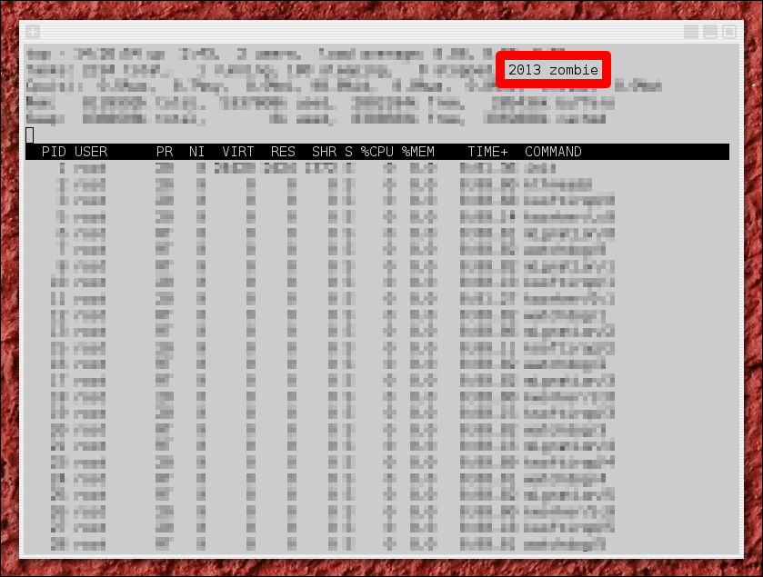

# Zombies [](https://travis-ci.org/vakuum/zombies)

A zombie process creation kit for Linux.

## Usage

```
$ git clone git://github.com/vakuum/zombies
$ cd zombies
$ gcc zombies.c -o zombies
$ ./zombies 2013 &
$ top
```



## Different flavors

### Fast zombies

```
$ gcc -Ofast zombies.c -o zombies
```

### Wall zombies

```
$ gcc -Wall zombies.c -o zombies
```

### Modern zombies

```
$ gcc -std=c1x zombies.c -o zombies
```

### Pedantic zombies

```
$ gcc -pedantic zombies.c -o zombies
```

### Stripped zombies

```
$ gcc zombies.c -o zombies
$ strip zombies
```

### Traditional zombies

```
$ gcc -std=c89 zombies.c -o zombies
```

## License

All zombies were released into the [public domain](https://en.wikipedia.org/wiki/Public_Domain) in 2013 by Clemens Fuchslocher.
